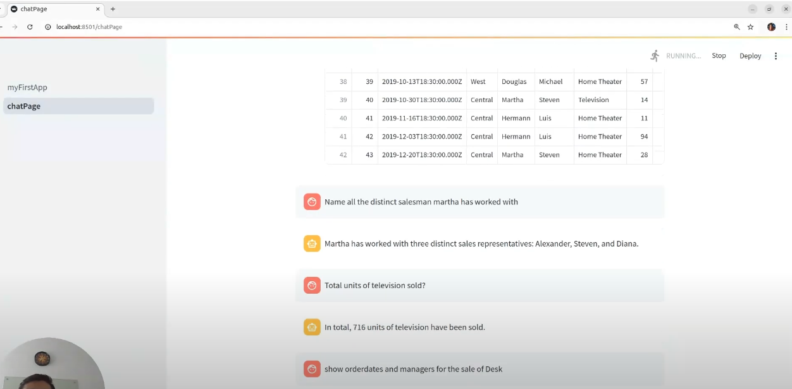

# smartQueryAssistant

# Sheetchat 📊💬

Sheetchat is an innovative natural language interface for Excel and CSV files that combines the power of SQL and LLMs to provide accurate, efficient data analysis. Unlike traditional RAG systems that struggle with calculations, Sheetchat transforms your spreadsheet data into a SQL database and uses a two-step LLM process to deliver precise answers to your queries.

## 🎯 What Makes Sheetchat Different?

Traditional chatbots often stumble when performing complex calculations on spreadsheet data. Sheetchat solves this by:

1. Converting your Excel/CSV data into a robust SQL database
2. Using Gemini LLM to translate natural language questions into precise SQL queries
3. Executing these queries for accurate calculations
4. Converting results back to natural language responses that directly answer your questions

## ⚡ Key Benefits

* **Accuracy**: By leveraging SQL's computational power instead of relying solely on LLMs
* **Efficiency**: Faster response times compared to traditional RAG systems
* **Natural Interaction**: Chat with your data using everyday language
* **Scalability**: Handles large datasets with ease

## 🚀 Demo

* Live Demo: https://frontend-dot-unique-alloy-438013-d6.ue.r.appspot.com/

## 🎥 Demo & Tutorial

*Click the image above to watch the demo video*

## ✨ Features

* **Natural Language Data Interaction**
  * Chat naturally with your Excel and CSV files
  * Automatic switching between table views and text responses based on context
  * Generate visualizations using the "plot" keyword (e.g., "plot line graph of sales")

* **Smart Data Processing**
  * SQL-powered calculations for accurate results
  * Two-step LLM processing: Natural Language → SQL → Natural Language
  * Handles complex queries and calculations efficiently

* **Dynamic Data Management**
  * Modify database through natural language commands
  * Create and manage different views of your data
  * Download processed data in various formats:
    * Custom views as new Excel files
    * Modified database tables
    * Query results in desired format

* **Intelligent Output Handling**
  * Automatic table formatting for structured data
  * Natural language responses for insights
  * Visual plots for trend analysis

## 🛠️ Technologies Used

Frontend

Streamlit: Main web application framework
Pyplot: Data visualization and plotting
Additional Libraries:

streamlit-extras: Enhanced UI components
pandas: Data manipulation and analysis

Backend

Node.js: Runtime environment
TypeScript: Programming language
Express.js: Web application framework
Google Cloud Platform (GCP): Cloud deployment

Cloud Run: Container deployment
Cloud SQL: Database hosting

Database

MySQL: Primary database

Data storage and querying
Dynamic view management

AI/ML

Google Gemini: LLM for natural language processing

Query translation
Response generation

DevOps

Docker: Containerization
GCP Cloud Build: CI/CD pipeline

